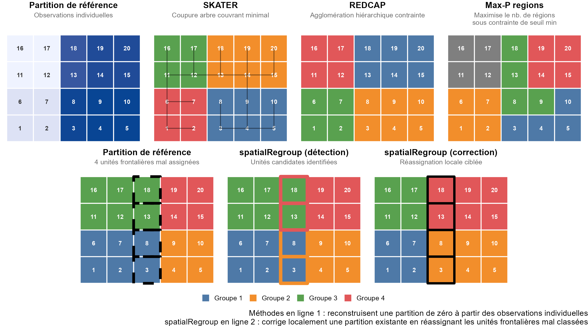
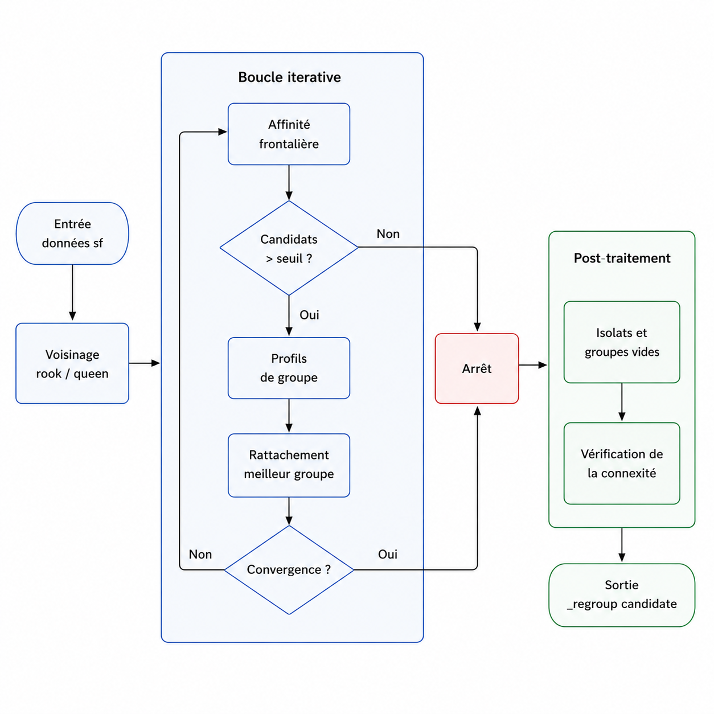
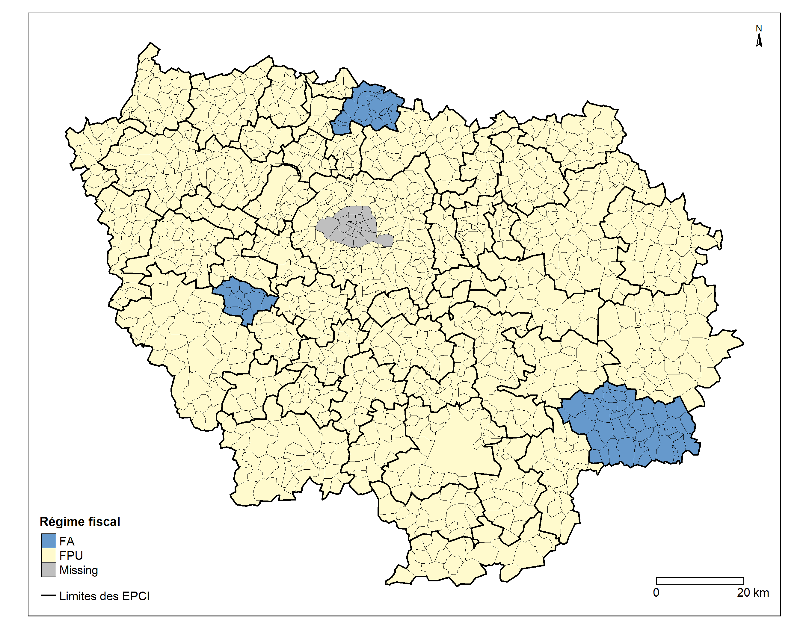
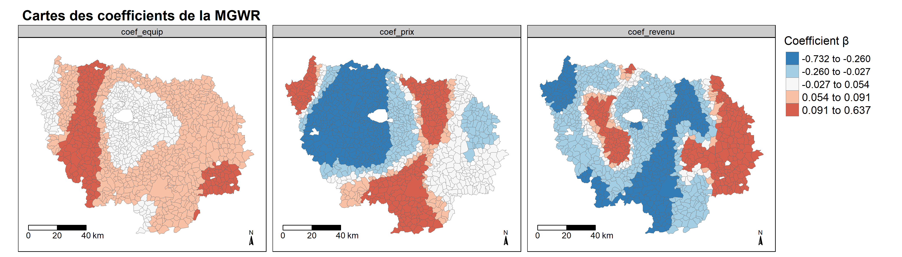
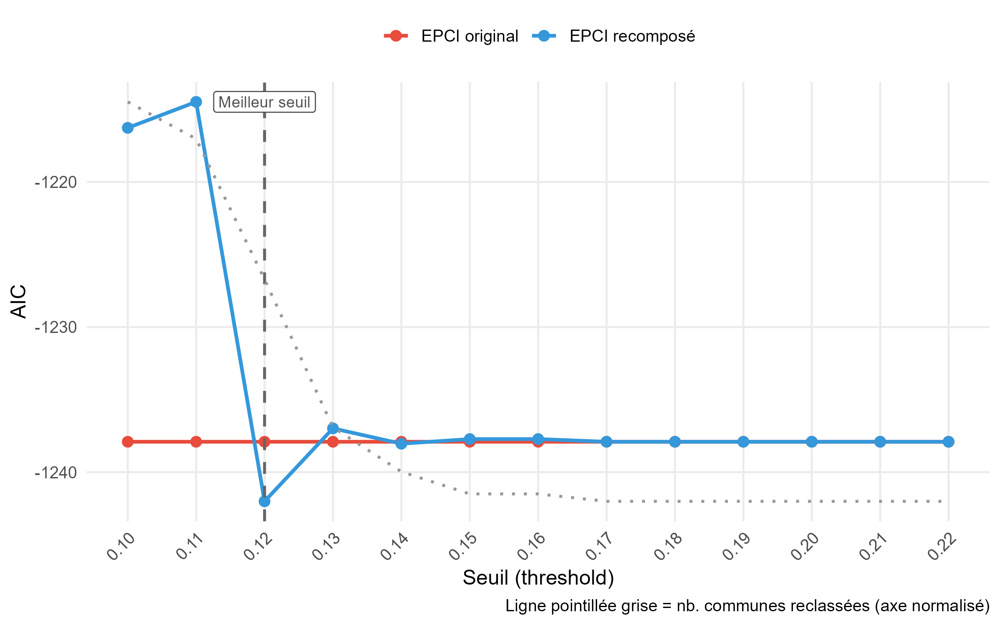
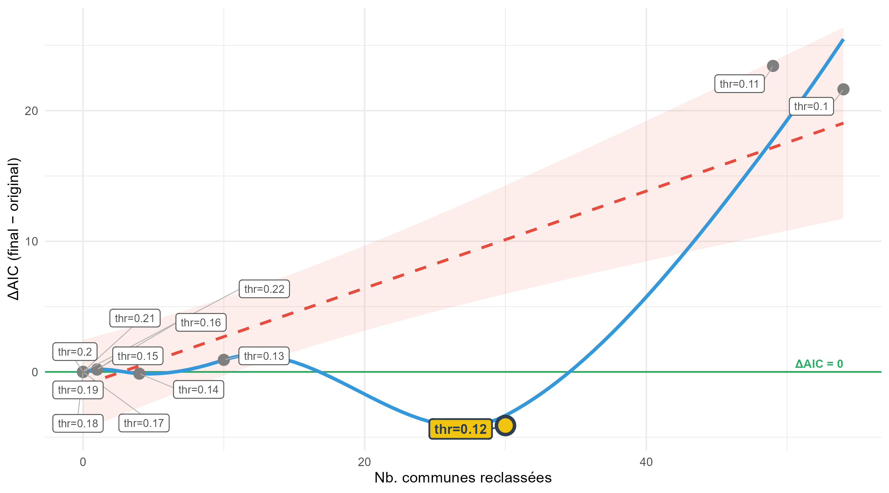

# Introduction

L'analyse spatiale des phénomènes sociaux repose sur la capacité à constituer des unités territoriales cohérentes, à la fois homogènes en termes de caractéristiques internes et pertinentes au regard de la thématique abordée. Ce défi de la **délimitation territoriale** est au cœur d'une littérature en géographie quantitative [@Openshaw1984; @Fotheringham2000], qui a progressivement mis en évidence les limites des découpages administratifs préexistants pour rendre compte de la réalité des dynamiques locales.

Le premier principe de géographie, formulé par @Tobler1970, postule que les unités spatiales proches se ressemblent davantage que les unités éloignées. Ce principe de dépendance spatiale fonde la légitimité des approches de **régionalisation contrainte** qui visent à construire des partitions territoriales respectant simultanément une contrainte de contiguïté spatiale et un critère d'homogénéité des caractéristiques retenues [@Duque2007]. Les méthodes développées dans cette perspective, parmi lesquelles la classification hiérarchique géographiquement contrainte [@Chavent2018], l'algorithme SKATER [@Assuncao2006] ou les approches REDCAP [@Guo2008], partagent une logique de reconstruction globale de la partition : elles ignorent les découpages institutionnels existants et optimisent une fonction de cohésion sur l'ensemble du territoire.

Cette logique de reconstruction présente une limite dans les contextes d'analyse des politiques territoriales, où la question posée n'est pas de créer un regroupement d'observations individuelles géolocalisées à partir de leurs caractéristiques, mais d'évaluer la pertinence d'un découpage administratif existant [@Coombes1986; @Farmer2011; @Klapka2013]. La distinction entre régions **fonctionnelles**, définies par les interactions effectives entre unités et régions **administratives** héritées de processus institutionnels, est en effet au cœur de nombreux travaux en géographie quantitative [@Openshaw1984; @Farmer2011].Les établissements publics de coopération intercommunale (EPCI), les arrondissements ou les zones d'emploi constituent des cadres institutionnels dont la cohérence statistique mérite d'être interrogée : dans quelle mesure reflètent-ils des réalités socio-spatiales homogènes, ou au contraire agrègent-ils des unités dont les profils seraient plus proches de groupements voisins [@Openshaw1984; @Briant2010] ? Les **effets de frontière** administratifs ont été documentés dans de nombreux domaines : fiscalité [@Revelli2003], marchés immobiliers [@Guerois2009; @Fack2010], concurrence fiscale et offre de services publics locaux [@Tiebout1956], suggérant que l'appartenance à un groupement institutionnel produit des effets propres, distincts des caractéristiques intrinsèques des unités qui le composent.

Cette question de la cohérence des observations au sein des découpages est d'autant plus complexe que leurs relations statistiques ne sont pas spatialement stationnaires : l'effet d'un déterminant sur une variable d'intérêt varie selon le contexte local [@Brunsdon1996]. La régression géographiquement pondérée (*Geographically Weighted Regression*, GWR) [@Fotheringham2002] et son extension multiscalaire (MGWR) [@Fotheringham2017; @Yu2020] permettent précisément d'estimer des coefficients locaux, commune par commune, capturant cette hétérogénéité spatiale des relations. Ces coefficients constituent une représentation du comportement territorial des unités vis-à-vis d'un phénomène donné, au-delà de leurs simples caractéristiques brutes. Nous soulignons donc l'intérêt de prendre en l'hétérogénéité spatiale des relations statistiques dans l'utilisation du package `spatialRegroup`, présenté dans cet article.

C'est donc également en tant qu'outil complémentaire des méthodes de régionalisation globale que peut être utilisé le package R `spatialRegroup`. Ce dernier adopte une logique complémentaire aux approches existantes : plutôt que de reconstruire une partition de zéro, il **part d'un découpage géographique existant** et identifie les seules unités frontalières dont le profil attributaire est statistiquement plus proche d'un groupement voisin que de leur propre groupement d'appartenance. Cette approche locale, fondée sur le calcul de distances euclidiennes dans le voisinage immédiat de chaque unité candidate, permet de corriger à la marge les incohérences d'une partition de l'espace sans en altérer la structure d'ensemble [@Openshaw1984].

Nous illustrons les capacités du package [`spatialRegroup`](https://cran.r-project.org/web/packages/spatialRegroup/index.html), disponible sur le CRAN, à travers une application à la taxe foncière sur les propriétés bâties (TFPB) en région Île-de-France sur l'année 2024. La TFPB constitue un cas d'application particulièrement pertinent puisque son taux résulte d'une superposition de décisions fiscales communales et intercommunales : l'appartenance d'une commune à un EPCI plutôt qu'un autre produit des effets directs capitalisés dans les prix immobiliers [@Fack2010; @Revelli2003]. Identifier les communes dont le profil fiscal est statistiquement incohérent avec leur EPCI d'appartenance revient ainsi à localiser des effets de frontières au niveau intercommunal.

```{r echo=T, warning=F, results=F, message=F}

# Liste des packages nécessaires 
library(scales)   
library(data.table)     
library(vroom)          
library(tidyverse)      
library(sf)           
library(sp) 
library(sjPlot)
library(spdep)         
library(GWmodel)        
library(lme4)           
library(rgeoda)       
library(spatialRegroup)
library(moments)      
library(DT)    
library(kableExtra)
library(patchwork)     
library(ggrepel)      
library(tmap)           
library(ggplot2)
library(plotly)
library(magrittr)
library(conflicted)

```

# Un package de regroupement local complémentaire aux outils de régionalisation

Un certain nombre de packages R permettent de regrouper des entités géographiques en fonction de variables attributaires en imposant une contrainte de contiguïté spatiale. Les approches les plus répandues relèvent de la **régionalisation globale** : il s'agit de produire une partition de l'ensemble des unités spatiales en $k$ régions homogènes, construites de zéro. C'est le cas de la fonction `skater()` du package `spdep`, fondée sur la suppression d'arêtes d'un arbre couvrant minimal construit à partir des dissimilarités entre unités voisines [@Assuncao2006]. Le package `rgeoda` [@rgeoda2022] propose quant à lui un ensemble d'algorithmes de régionalisation contraints (SKATER, REDCAP [@Guo2008], Max-P), offrant une palette plus large mais relevant du même paradigme. Parmi ces algorithmes, Max-P [@Duque2012] se distingue en ne fixant pas le nombre de régions $k$ *a priori* : il maximise le nombre de régions spatialement contiguës sous la contrainte qu'un seuil minimum d'unités soit respecté dans chaque région, ce qui contrôle indirectement leur taille et leur cohérence interne.

Les approches que nous prenons ici comme exemple partagent néanmoins une limite commune : elles reconstruisent intégralement la partition à partir des observations individuelles, sans tenir compte d'un éventuel découpage préexistant. `spatialRegroup` se positionne en complément de ces méthodes : plutôt que de substituer une nouvelle partition à une partition existante, il procède à une correction locale en identifiant les unités frontalières dont le profil attributaire est statistiquement plus proche d'un groupe voisin que de leur groupe d'appartenance, et en les réassignant sans modifier le découpage global. Il devient utile dans des situations où une partition de référence, institutionnelle ou *data-driven* (découpage géographique construit directement à partir des données), doit être affinée à la marge plutôt que reconstruite de zéro.

```{r echo=F, warning=F, results=F, message=F, cache=T}

conflicts_prefer(plotly::filter)

set.seed(831)

# Création d'une grille 
bbox   <- st_as_sfc(st_bbox(c(xmin=0, ymin=0, xmax=5, ymax=4), crs = NA))
grille <- st_make_grid(bbox, n = c(5, 4), square = TRUE) |>
  st_as_sf() |>
  mutate(id = row_number())

coords_g <- st_centroid(grille) |> st_coordinates()

grille <- grille |>
  mutate(secteur = case_when(
    coords_g[,1] <= 2.5 & coords_g[,2] <= 2 ~ "A",
    coords_g[,1] >  2.5 & coords_g[,2] <= 2 ~ "B",
    coords_g[,1] <= 2.5 & coords_g[,2] >  2 ~ "C",
    TRUE                                      ~ "D"
  ))

# Création de variables fictives 
profil <- list(A=c(10,80), B=c(80,10), C=c(10,10), D=c(80,80))

grille <- grille |>
  mutate(
    v1 = case_when(
      id %in% c(3, 8)   ~ profil$B[1] + rnorm(1, 0, 3),
      id %in% c(13, 18) ~ profil$D[1] + rnorm(1, 0, 3),
      secteur == "A"    ~ profil$A[1] + rnorm(1, 0, 3),
      secteur == "B"    ~ profil$B[1] + rnorm(1, 0, 3),
      secteur == "C"    ~ profil$C[1] + rnorm(1, 0, 3),
      TRUE              ~ profil$D[1] + rnorm(1, 0, 3)
    ),
    v2 = case_when(
      id %in% c(3, 8)   ~ profil$B[2] + rnorm(1, 0, 3),
      id %in% c(13, 18) ~ profil$D[2] + rnorm(1, 0, 3),
      secteur == "A"    ~ profil$A[2] + rnorm(1, 0, 3),
      secteur == "B"    ~ profil$B[2] + rnorm(1, 0, 3),
      secteur == "C"    ~ profil$C[2] + rnorm(1, 0, 3),
      TRUE              ~ profil$D[2] + rnorm(1, 0, 3)
    )
  )

vars <- c("v1", "v2")
df   <- st_drop_geometry(grille)[, vars]

# Mise en place du voisinage 
nb    <- poly2nb(grille, queen = FALSE)
costs <- nbcosts(nb, df)
lw    <- nb2listw(nb, costs, style = "B")

# SKATER 
mst  <- mstree(lw)
skat <- spdep::skater(mst[, 1:2], df, ncuts = 3)
grille$grp_sk <- factor(skat$groups)

mst_df <- data.frame(
  x1 = coords_g[mst[,1], 1], y1 = coords_g[mst[,1], 2],
  x2 = coords_g[mst[,2], 1], y2 = coords_g[mst[,2], 2]
)

# Rgeoda REDCAP
rook_w <- rook_weights(grille)
rc     <- redcap(4, rook_w, df)
grille$grp_rg <- factor(rc$Cluster)

# Rgeoda Max-P greedy
mp <- maxp_greedy(
  w         = rook_w,
  df        = st_drop_geometry(grille)[, vars],
  bound_var = data.frame(bound = rep(1, nrow(grille))),
  min_bound = 4
)
grille$grp_mp <- factor(mp$Clusters)

# spatialRegroup 
res_sr <- spatialRegroup(
  grille,
  group_var = "secteur",
  vars_attr = vars,
  verbose   = FALSE
)
grille$candidate       <- res_sr$candidate
grille$secteur_regroup <- res_sr$secteur_regroup

# Harmonisation des noms
grp_labels <- c("Groupe 1","Groupe 2","Groupe 3","Groupe 4")

grille <- grille |>
  mutate(
    g_sk    = factor(paste("Groupe", as.integer(grp_sk))),
    g_rg    = factor(paste("Groupe", as.integer(grp_rg))),
    g_mp    = factor(paste("Groupe", as.integer(grp_mp))),
    g_avant = factor(paste("Groupe", as.integer(factor(secteur)))),
    g_apres = factor(paste("Groupe", as.integer(factor(secteur_regroup))))
  )

labels_g <- coords_g |>
  as.data.frame() |>
  mutate(id = grille$id)

# Palette de couleurs
pal4 <- c("Groupe 1"="#4E79A7","Groupe 2"="#F28E2B",
          "Groupe 3"="#59A14F","Groupe 4"="#E15759")

dest_colors <- grille |>
  plotly::filter(candidate) |>
  st_drop_geometry() |>
  mutate(dest_col = pal4[g_apres]) |>
  select(id, dest_col)

reclasse_boxes <- coords_g |>
  as.data.frame() |>
  mutate(id = grille$id) |>
  plotly::filter(id %in% dest_colors$id) |>
  left_join(dest_colors, by = "id") |>
  mutate(xmin = X - 0.5, xmax = X + 0.5,
         ymin = Y - 0.5, ymax = Y + 0.5)

anomalies_df <- labels_g |> dplyr::filter(id %in% c(3, 8, 13, 18))

# Thème 
theme_ep2 <- theme_void(base_size = 9) +
  theme(
    plot.title       = element_text(face = "bold", size = 9.5,
                                    hjust = 0.5, margin = margin(b = 3)),
    plot.subtitle    = element_text(size = 7.5, hjust = 0.5,
                                    color = "grey40", margin = margin(b = 4)),
    legend.position  = "bottom",
    legend.title     = element_blank(),
    legend.text      = element_text(size = 7.5),
    legend.key.size  = unit(0.35, "cm"),
    legend.spacing.x = unit(0.15, "cm"),
    plot.margin      = margin(6, 6, 2, 6)
  )

scale_grp2 <- scale_fill_manual(
  name   = " ",
  values = pal4,
  breaks = grp_labels
)

# Carte générique
mk2 <- function(data, fill_var, title, subtitle, extra = NULL) {
  p <- ggplot(data) +
    geom_sf(aes(fill = .data[[fill_var]]),
            color = "white", linewidth = 0.5) +
    geom_text(data = labels_g, aes(X, Y, label = id),
              size = 2.4, color = "white", fontface = "bold") +
    scale_grp2 +
    labs(title = title, subtitle = subtitle) +
    theme_ep2
  if (!is.null(extra)) p <- p + extra
  p
}

# Panneau : partition de référence (anomalies encadrées) 
p_ref <- ggplot(grille) +
  geom_sf(aes(fill = g_avant), color = "white", linewidth = 0.5) +
  geom_text(data = labels_g, aes(X, Y, label = id),
            size = 2.4, color = "white", fontface = "bold") +
  geom_rect(data = anomalies_df |>
              mutate(xmin=X-0.5, xmax=X+0.5, ymin=Y-0.5, ymax=Y+0.5),
            aes(xmin=xmin, xmax=xmax, ymin=ymin, ymax=ymax),
            fill = NA, color = "black", linewidth = 1.4, linetype = "dashed") +
  scale_grp2 +
  labs(title    = "Partition de référence",
       subtitle = "4 unités frontalières mal assignées") +
  theme_ep2

# Panneau : entrée méthodes classiques
labels_g_col <- labels_g |>
  mutate(
    v1_val  = grille$v1,
    txt_col = ifelse(v1_val > 45, "white", "grey20")
  )

p_indiv <- ggplot(grille) +
  geom_sf(aes(fill = v1), color = "white", linewidth = 0.5) +
  geom_text(data = labels_g_col,
            aes(X, Y, label = id, color = txt_col),
            size = 2.4, fontface = "bold") +
  scale_fill_gradient(low = "#EFF3FF", high = "#084594", guide = "none") +
  scale_color_identity() +
  labs(title = "Partition de référence",
    subtitle = "Observations individuelles") +
  theme_ep2 +
  theme(legend.position = "none")

# Panneaux méthodes classiques
p_sk <- mk2(grille, "g_sk",
            "SKATER",
            "Coupure arbre couvrant minimal",
            extra = geom_segment(
              data = mst_df,
              aes(x=x1, y=y1, xend=x2, yend=y2),
              color = "black", linewidth = 0.4, alpha = 0.5
            ))

p_rg <- mk2(grille, "g_rg",
            "REDCAP",
            "Agglomération hiérarchique contrainte")

p_mp <- mk2(grille, "g_mp",
            "Max-P regions",
            "Maximise le nb. de régions\nsous contrainte de seuil min")

# Panneau spatialRegroup : détection
p_sr_avant <- ggplot(grille) +
  geom_sf(aes(fill = g_avant), color = "white", linewidth = 0.5) +
  geom_rect(data = reclasse_boxes,
            aes(xmin=xmin, xmax=xmax, ymin=ymin, ymax=ymax),
            fill = NA, color = reclasse_boxes$dest_col, linewidth = 1.8) +
  geom_text(data = labels_g, aes(X, Y, label = id),
            size = 2.4, color = "white", fontface = "bold") +
  scale_grp2 +
  labs(title    = "spatialRegroup (détection)",
       subtitle = "Unités candidates identifiées") +
  theme_ep2

# Panneau spatialRegroup : correction
p_sr_apres <- mk2(grille, "g_apres",
                  "spatialRegroup (correction)",
                  "Réassignation locale ciblée",
                  extra = geom_sf(
                    data = dplyr::filter(grille, candidate),
                    fill = NA, color = "black", linewidth = 1.2
                  ))


# Composition finale
theme_serré <- theme(
  legend.position = "none",
  plot.margin     = margin(2, 2, 2, 2)   # marges minimales en pts
)

ligne1 <- wrap_plots(
  p_indiv, p_sk, p_rg, p_mp,
  nrow = 1
) & theme_serré

ligne2 <- wrap_plots(
  p_ref, p_sr_avant, p_sr_apres,
  nrow  = 1,
  widths = c(1, 1, 1)
) & theme_serré

ligne2_centree <- wrap_plots(
  plot_spacer(), ligne2, plot_spacer(),
  nrow   = 1,
  widths = c(0.5, 3, 0.5)
)

legende_unique <- ggpubr::get_legend(p_sk) |> ggpubr::as_ggplot()

planche_ok <- (ligne1 / ligne2_centree / legende_unique) +
  plot_layout(heights = c(1, 1, 0.12)) +
  plot_annotation(
    caption = paste0(
      "Méthodes en ligne 1 : reconstruisent une partition de zéro à partir des observations individuelles\n",
      "spatialRegroup en ligne 2 : corrige localement une partition existante en réassignant les unités frontalières mal classées"
    ),
    theme = theme(
      plot.margin   = margin(4, 4, 4, 4),   # ← marge globale réduite
      plot.subtitle = element_text(size = 8, hjust = 0.5,
                                   color = "grey40", margin = margin(b = 6))
    )
  )

ggsave(
  filename = "figures/planche_ok.png",
  plot     = planche_ok,
  width    = 9,
  height   = 5,
  dpi      = 300,
  bg       = "white",
  # Forcer les marges à zéro sur le plot final avant sauvegarde
  device   = function(...) {
    planche_ok_trimmed <- planche_ok &
      theme(plot.margin = margin(0, 0, 0, 0))
    ggsave(..., plot = planche_ok_trimmed)
  }
)

```

::: {style="display:flex; justify-content:center; width:100%;"}
```{r echo=F, warning=F, results=T, message=T, cache=T}
#| fig-align: center
#| fig-cap: "Figure 1 : Comparaison de quatre approches de regroupement d'entités spatiales (Auteur, 2026)"
#| fig-cap-location: bottom
#| out-width: "100%"



```
:::

Sur cet exemple (figure 1), les cellules 3, 8, 13 et 18 ont été construites avec un profil attributaire délibérément incohérent avec leur groupe d'appartenance. SKATER, REDCAP et Max-P les ignorent car ils reconstruisent la partition de zéro sans référence au découpage initial, produisant des partitions globalement cohérentes mais sans capacité à corriger des anomalies frontalières au sein d'un découpage existant. `spatialRegroup`, partant de la partition de référence, identifie ces quatre cellules comme candidates et les réaffecte correctement vers leur groupe d'affinité attributaire, sans modifier les unités non frontalières.

```{r}
#| echo: false
#| warning: false
#| message: false
#| fig-align: center
#| html-table-processing: none  

data.frame(
  Critère = c(
    "Partition initiale requise",
    "k groupes à fixer",
    "Unités traitées",
    "Traitement des isolats",
    "Validation multiniveaux"
  ),
  `Max-P`        = c("Non", "Non", "Toutes", "Non", "Non"),
  `skater()`     = c("Non", "Oui", "Toutes", "Non", "Non"),
  rgeoda         = c("Non", "Oui", "Toutes", "Non", "Non"),
  spatialRegroup = c("Oui", "Non", "Frontalières", "Oui", "Oui"),
  check.names    = FALSE
) |>
  knitr::kable(
    format    = "html",
    escape    = FALSE,
    align     = c("l", "c", "c", "c", "c"),
    col.names = c("Critère", "Max-P", "SKATER", "REDCAP", "spatialRegroup")
  ) |>
  kable_styling(
    bootstrap_options = c("bordered", "hover", "condensed"),
    full_width        = TRUE,
    position          = "center",
    font_size         = 16
  ) |>
  row_spec(0, bold = TRUE, background = "#343a40", color = "white", font_size = 17) |>
  column_spec(1, width = "30%") |>
  column_spec(2:5, width = "17.5%") |>
  column_spec(5, bold = TRUE, color = "black")
```

::: figure-caption
Tableau 1 : Comparaison de `spatialRegroup` avec les principales méthodes de régionalisation contrainte disponibles dans R (Auteur, 2026).
:::

`spatialRegroup` se distingue donc des trois approches prises en exemple en ne construisant pas de matrice globale : la dissimilarité est calculée localement pour chaque unité frontalière, en comparant sa distance euclidienne moyenne aux unités intra-groupe et extra-groupe dans son voisinage immédiat. Ce calcul local évite les effets d'échelle propres aux matrices globales et préserve la structure spatiale initiale pour les unités intérieures. Contrairement aux méthodes de régionalisation globale présentées précédemment, cette approche part d'un découpage existant et n'intervient que là où ce découpage apparaît statistiquement incohérent. L'idée centrale repose sur la notion d'**effet de frontière** : une unité spatiale est considérée comme mal classée dans son groupe d'appartenance lorsque son profil attributaire est plus proche de celui des unités voisines appartenant à un groupe adjacent que de celui de ses propres voisins intra-groupe. Le fonctionnement `spatialRegroup` repose sur trois étapes distinctes des approches citées (figure 2) :

1.  **Le point de départ est une partition existante** (dans l'exemple qui suit, les Établissements Publics de Coopération Intercommunale, EPCI) dont la structure est conservée pour les unités bien classées.
2.  **Seules les unités frontalières** (celles qui sont en contact avec un groupement voisin différent) sont candidates à la reclassification, sur la base de leur distance euclidienne aux profils attributaires moyens des groupes adjacents.
3.  **Un mécanisme de traitement des isolats** réintègre dans leur groupe d'origine les unités candidates qui se retrouveraient seules après reclassification, garantissant la cohérence géographique du résultat.

Enfin, `spatialRegroup` intègre nativement des outils de validation par modèles multiniveaux : la comparaison des AIC entre la partition initiale et la partition recomposée permet de mesurer si le regroupement corrigé explique mieux la variable d'intérêt que le découpage géographique de départ.

::: {.callout-note title="L'AIC : signal de la pertinence géographique du regroupement"}
L'AIC (*Akaike Information Criterion*) permet de comparer des modèles concurrents en mesurant leur qualité d'ajustement aux données, pénalisée par leur complexité. Un AIC plus bas indique un modèle préférable.

Dans le cadre des modèles multiniveaux, il permet ainsi de déterminer quelle structure de regroupement capture le mieux la variance observée, sans surajuster les données par l'ajout de paramètres superflus.
:::

```{r}
#| echo: false
#| fig-cap: "Figure 2 : Boucle itérative et post-traitement du package spatialRegroup (Auteur, 2026)"
#| fig-align: center
#| out-width: "80%"


```

Une série de travaux en modélisation spatiale ont pour objectifs d'identifier des contextes spatiaux spécifiques au sein desquels la relation entre différents phénomènes n'est pas la même que dans d'autres, afin de formuler des recommandations en matière de politiques publiques. Les méthodes de régression géographiquement pondérée [GWR, @Brunsdon1996; @Fotheringham2002] s'inscrivent dans cette démarche : en estimant des coefficients locaux unité par unité, elles permettent de cartographier des variations spatiales de la relation entre une variable d'intérêt et ses déterminants.

Ces contextes spatiaux ainsi identifiés peuvent alors alimenter une modélisation multiniveau, dont la limite structurelle réside précisément dans la nécessité de définir les niveaux d'agrégation *a priori*, le plus souvent sur la base de découpages administratifs. En estimant des modèles GWR en amont, il devient possible de délimiter des contextes directement dérivés des données (*data-driven*), s'affranchissant ainsi de ce présupposé [@Feuillet2021]. Cette approche hybride GWR-multiniveau construit un maillage de l'espace géographique qui ne coïncide pas nécessairement avec les découpages administratifs qui structurent l'action publique [@Feuillet2024; @Mangeney2024].

Dans cette même logique mais de manière différente, `spatialRegroup` offre la possibilité de tester la validité d'un regroupement d'observations au regard du processus géographique étudié, tout en ménageant la possibilité que le découpage existant demeure pertinent. Le package produit un diagnostic plutôt qu'une remise en cause systématique des partitions de départ. L'enjeu est donc d'identifier les unités spatiales (communes, quartiers ou toute autre maille choisie par l'analyste) qui se révèlent statistiquement plus proches d'un groupement voisin que de leur propre groupement d'appartenance. En mobilisant les coefficients locaux issus d'une GWR comme variables d'affinité, le package traduit les résultats d'une GWR en une évaluation de la partition de départ : là où les inadéquations sont avérées, il ouvre la possibilité d'une reconfiguration territoriale ciblée ; là où elles sont absentes, il confirme la pertinence du découpage existant.

# Application du Package `spatialRegroup` : les effets de contexte sur la taxe foncière bâti (TFB) en région Île-de-France

Nous proposons une application de `spatialRegroup` à la taxe foncière sur les propriétés bâties (TFPB) en région Île-de-France pour l'année 2024. Ce cas d'application est particulièrement adapté car le taux de TFPB effectivement supporté par les propriétaires résulte d'une superposition de décisions communales et intercommunales. L'appartenance d'une commune à un EPCI plutôt qu'un autre produit donc des effets fiscaux directs. Identifier les communes dont le profil est statistiquement incohérent avec leur EPCI d'appartenance revient à localiser des zones de friction aux frontières intercommunales. Avant d'appliquer le package, nous esquissons brièvement la structure institutionnelle qui détermine ces effets.

## Les régimes fiscaux sur la propriété en Île-de-France 

Sur 1283 communes franciliennes (hors Paris), 1192 sont sous le régime de la fiscalité professionnelle unique (FPU) et 71 sous le régime de la fiscalité additionnelle (FA) (figure 3). Ces deux régimes se distinguent principalement par le traitement de la fiscalité économique, mais convergent sur un point important pour notre propos : dans les deux cas, le taux global de TFPB effectivement acquitté par les propriétaires résulte d'une superposition du taux communal et d'un taux additionnel voté par l'EPCI : l'appartenance d'une commune à un groupement intercommunal plutôt qu'un autre détermine directement le niveau de pression fiscale sur son territoire.

```{r}

fichiers_shp <- list(
  communes = "https://zenodo.org/records/21307967/files/communes.zip"
)

options(timeout = 3600)  

dir.create("data", showWarnings = FALSE)
dir.create("data/shp", showWarnings = FALSE)

for (nom in names(fichiers_shp)) {
  dest <- paste0("data/shp/", basename(fichiers_shp[[nom]]))
  if (!file.exists(dest)) {
    download.file(fichiers_shp[[nom]], destfile = dest, mode = "wb")
  }
  
  dossier_extrait <- file.path("data/shp", nom)
  if (!dir.exists(dossier_extrait)) {
    unzip(dest, exdir = dossier_extrait)
  }
}


```


```{r}
#| echo: false
#| warning: false
#| message: false

tmap_mode("plot")

# Données des régimes fiscaux par code commune 
regime_fisc <- readr::read_csv2("data/regime_fiscal.csv", locale = readr::locale(encoding = "UTF-8"))

# Données spatiales des communes
com <- read_sf("data/communes.shp")

regime_fisc2 <- com |>
  dplyr::left_join(
    regime_fisc,
    by = c("DCOE_C_COD" = "insee")
  )

regime_fisc_idf <- regime_fisc2 |>
  dplyr::filter(DDEP_C_COD %in% c("75", "77", "78", "91", "92", "93", "94", "95"))

regime_fisc_idf <- regime_fisc_idf |>
  sf::st_make_valid()

carte_regime <-  tm_shape(regime_fisc_idf) +
  tm_polygons(
    col        = "finance",
    palette    = c("FPU" = "lemonchiffon", "FA" = "#6699CC"),
    border.col = "grey0",
    lwd        = 0.2,
    title      = "Régime fiscal"
  ) +
  tm_shape(
    regime_fisc_idf |>
      sf::st_make_valid() |>
      dplyr::group_by(EPCI_CODE) |>
      dplyr::summarise(geometry = sf::st_union(geometry)) |>
      sf::st_cast("MULTILINESTRING")
  ) +
  tm_lines(
    col  = "black",
    lwd  = 1.8
  ) +
  tm_add_legend(
    type   = "line",
    col    = "black",
    lwd    = 2.0,
    size   = 2.0,
    labels = "Limites des EPCI"
  ) +
  tm_scale_bar(
    breaks    = c(0, 20),
    text.size = 0.8,
    position  = c("right", "bottom")
  ) +
  tm_compass(
    type      = "arrow",
    size      = 1.2,
    text.size = 0.6,
    position  = c("right", "top")
  ) +
  tm_layout(
    legend.outside          = F,
    legend.position         = c("left", "bottom"),
    legend.outside.size     = 0.18,
    legend.title.size       = 1,
    legend.title.fontface   = "bold",
    legend.text.size        = 0.8,
    frame                   = TRUE,
    frame.lwd               = 1.5,
    inner.margins           = c(0.05, 0.05, 0.05, 0.05)
  )

tmap_save(
  tm       = carte_regime,
  filename = "figures/carte_regime_fiscal.png",
  width    = 9,
  height   = 7,
  dpi      = 300
)

```

```{r}
#| echo: false
#| warning: false
#| message: false
#| fig-cap: "Figure 3 : Cartes des régimes fiscaux des EPCI franciliens (Auteur, 2026, source : DGCL/Département des études et des statistiques locales, 2026)"
#| fig-cap-location: bottom
#| fig-width: 9
#| fig-height: 7
#| out-width: "100%"



```

## Les données retenues

Dans le cadre de l'application du package `spatialRegroup` au cas de la fiscalité sur la propriété immobilière, nous mobilisons quatre jeux de données pour les communes d'Île-de-France, à l'exclusion de Paris. Cette exclusion se justifie par le statut administratif singulier de Paris par rapport aux autres Etablissement publics territoriaux (EPT) et EPCI, et dont la taille constituerait un effet levier démesuré sur les paramètres de l'algorithme. Le périmètre retenu couvre ainsi les sept départements de grande et petite couronne (77, 78, 91, 92, 93, 94, 95), pour un échantillon de 1250 communes disposant de données complètes sur l'ensemble des variables.

- **Les données Demandes de Valeurs Foncières (DVF)**, issues de la base *open data* de la Direction Générale des Finances Publiques, renseignent l'ensemble des transactions immobilières enregistrées entre 2021 et 2024. Après filtrage sur la nature des mutations (ventes uniquement) et le type de bien (maisons et appartements), les valeurs aberrantes sont exclues selon des seuils raisonnés : prix compris entre 15 000 € et 5 000 000 €, surface entre 10 et 350 m² (200 m² pour les appartements), et prix au m² entre 330 € et 10 000 €. Ces seuils visent à éliminer les transactions multiventes et les enregistrements erronés sans tronquer la distribution des marchés les plus tendus de l'agglomération [@Mericskay2022]. Le recours à quatre années consécutives, plutôt qu'à une seule, permet de stabiliser les estimations communales du prix moyen au m² (prix_m2_moy), particulièrement nécessaire pour les communes à faible volume de transactions.

- **Les données de fiscalité locale**, transmises annuellement par la DGFiP aux services de l'État, fournissent le taux global de taxe foncière sur les propriétés bâties (Taux_Global_TFB) pour chaque commune pour l'exercice fiscal de l'année 2024. Ce taux global agrège le taux communal et le taux additionnel intercommunal, reflétant ainsi directement l'effet de l'appartenance à un EPCI sur la charge fiscale des propriétaires. Le taux 2024 (Taux_TFB_2024) est retenu comme variable d'intérêt principale dans la modélisation, en raison de sa plus grande proximité avec les effets institutionnels récents liés aux processus d'harmonisation fiscale intercommunale.

- **La Base Permanente des Équipements (BPE) de l'INSEE** recense l'offre d'équipements et de services à la population par commune. Afin de lisser les effets conjoncturels, le nombre d'équipements est calculé comme la moyenne des millésimes 2019 et 2024 (moy_equip). Cette variable témoigne de l'attractivité et du niveau de service d'une commune, déterminant supposé de la pression fiscale locale et de la demande résidentielle [@Tiebout1956].

- **Les données de revenus de l'INSEE**, issues du dispositif Filosofi, fournissent le revenu médian par unité de consommation à l'échelle communale pour l'année 2021 (median). Le revenu médian est le principal déterminant socio-économique du taux de TFPB retenu ici : il conditionne à la fois la capacité contributive des ménages et la sensibilité politique aux décisions fiscales locales.

Ces quatre sources sont agrégées a l'échelon communale pour constituer la base de travail finale (df_final), téléchargeable ci-dessous :

```{r echo=FALSE, message=FALSE, warning=FALSE}
library(downloadthis)

readRDS("data/df_final.rds") |>
  sf::st_drop_geometry() |>
  download_this(
    output_name      = "df_final_communes_idf",
    output_extension = ".csv",
    button_label     = "Télécharger la base de données (CSV)",
    button_type      = "primary",
    has_icon         = TRUE,
    icon             = "fa fa-download"
  )
```

```{r  echo=F, warning=F, message=F, results=F, eval=F}

# Téléchargement des bases de données 

dir.create("data", showWarnings = FALSE)

fichiers <- list(
  bpe            = "https://zenodo.org/records/21261696/files/bpe.csv",
  epci_com_idf   = "https://zenodo.org/records/21261696/files/codes_epci-com.csv",
  dvf21          = "https://zenodo.org/records/21261696/files/dvf2021.csv",
  dvf22          = "https://zenodo.org/records/21261696/files/dvf2022.csv",
  dvf23          = "https://zenodo.org/records/21261696/files/dvf2023.csv",
  dvf24          = "https://zenodo.org/records/21261696/files/dvf2024.csv",
  rev_21         = "https://zenodo.org/records/21261696/files/revenu_2021.csv",
  ept_idf        = "https://zenodo.org/records/21261696/files/ept_IDF.csv",
  fisc           = "https://zenodo.org/records/21261696/files/fiscalite_locale_21-24.csv"
)
    
options(timeout = 3600) 
for (nom in names(fichiers)) {
  dest <- paste0("data/", basename(fichiers[[nom]]))
  if (!file.exists(dest)) {
    download.file(fichiers[[nom]], destfile = dest, mode = "wb")
  }
} 


```
  

```{r  echo=F, warning=F, message=F, results=F, eval=F}

# Chargement des données 

  # Données de prix 
dvf21 <- readr::read_csv("data/dvf2021.csv", locale = readr::locale(encoding = "UTF-8"))
dvf22 <- readr::read_csv("data/dvf2022.csv", locale = readr::locale(encoding = "UTF-8"))
dvf23 <- readr::read_csv("data/dvf2023.csv", locale = readr::locale(encoding = "UTF-8"))
dvf24 <- readr::read_csv("data/dvf2024.csv", locale = readr::locale(encoding = "UTF-8"))

  # Données d'équipements 
bpe <- readr::read_csv("data/bpe.csv")

  # Données de la fiscalité locale 
fisc <- readr::read_csv("data/fiscalite_locale_21-24.csv", locale = readr::locale(encoding = "UTF-8"))

  # Données de revenus (2021)
rev_21 <- readr::read_csv("data/revenu_2021.csv", locale = readr::locale(encoding = "UTF-8"))

  # Données ID EPCI + Communes + EPT IDF 
epci_com_idf <-  readr::read_csv("data/codes_epci-com.csv", locale = readr::locale(encoding = "UTF-8"))
ept_idf <-  readr::read_csv("data/ept_IDF.csv", locale = readr::locale(encoding = "UTF-8"))

```

```{r  echo=F, warning=F, message=F, results=F, cache=F, eval=F}

data <- readRDS("data_projet.rds")
list2env(data, envir = .GlobalEnv)

```

```{r  echo=F, warning=F, message=F, results=F, cache=T, eval=F}

conflicts_prefer(dplyr::between)
conflicts_prefer(plotly::filter)

# Liste des jeux de données à traiter
datasets <- list(dvf21, dvf22, dvf23, dvf24)
names(datasets) <- c("dvf21", "dvf22", "dvf23", "dvf24")
   
# Initialisation d'une liste pour stocker les résultats finaux
resultats <- list()
  
# Boucle sur chaque jeu de données
for (i in seq_along(datasets)) {
  DVF <- datasets[[i]]

  # 1.1 Sélection des ventes de maisons et appartements
  etape1 <- DVF %>% filter(nature_mutation == "Vente")
  etape1bis <- etape1 %>% filter(type_local == "Maison" | type_local == "Appartement")

  # 1.2 Sélection et renommage des variables
  etape3 <- etape1bis %>%
    rename(
      id = id_mutation,
      disposition = numero_disposition,
      parcelle = id_parcelle,
      date = date_mutation,
      nature = nature_mutation,
      codecommune = code_commune,
      departement = code_departement,
      type = type_local,
      surface = surface_reelle_bati,
      piece = nombre_pieces_principales,
      prix = valeur_fonciere
    )

  # 1.3 Suppression des doublons et des mutations multiventes
  unique <- etape3 %>% distinct(id, prix, surface)
  nbunique <- unique %>% group_by(id) %>% summarise(nb = n())
  etape4 <- nbunique %>% filter(nb == 1)
  merge <- cbind(etape4, etape3[match(etape4$id, etape3$id), -1, drop = TRUE])
  selecVar <- c("id", "date", "type", "nature", "codecommune", "departement", "prix", "surface", "piece", "latitude", "longitude")
  etape5 <- merge[, selecVar]

  # 1.4 Suppression des valeurs aberrantes
  etape5$prix <- as.numeric(etape5$prix)
  etape5$surface <- as.numeric(etape5$surface)
  etape5$piece <- as.numeric(etape5$piece)
  etape5 <- etape5 %>% filter(!is.na(prix))

  # 1.4.1 Sélection des bornes de prix et de surface
  etape6 <- etape5 %>%
    filter(between(prix, 15000, 5000000)) %>%
    filter(
      case_when(type == 'Appartement' ~ between(surface, 10, 200)) |
      case_when(type == 'Maison' ~ between(surface, 10, 350))
    )

  # 1.5 Calcul du prix au m² et exclusion des valeurs extrêmes
etape7 <- etape6 %>%
  mutate(
    prixm2 = prix / surface,
    # Vérification : prixm2 doit être égal à prix / surface
    check = ifelse(prixm2 == prix / surface, TRUE, FALSE)
  )

# Affiche les lignes où le calcul est incorrect
etape7[etape7$check == FALSE, c("prix", "surface", "prixm2")]
etape8 <- etape7 %>% filter(between(prixm2, 330, 10000))

  # Stockage du résultat final
  resultats[[names(datasets)[i]]] <- etape8
}

# Exemple d'accès aux résultats modifiés
df_modifie_2021 <- resultats$dvf21
df_modifie_2022 <- resultats$dvf22
df_modifie_2023 <- resultats$dvf23
df_modifie_2024 <- resultats$dvf24

# Liste des DataFrames DVF modifiés (résultats de la boucle précédente)
dvf_list <- list(dvf21 = resultats$dvf21,
                 dvf22 = resultats$dvf22,
                 dvf23 = resultats$dvf23,
                 dvf24 = resultats$dvf24)

# Construction de la moyenne du nbre d'équipement 2019-2024
bpe1 <- bpe %>%
  group_by(GEO, TIME_PERIOD) %>%
  summarise(
    nb_equipements = sum(OBS_VALUE, na.rm = TRUE),
    .groups = "drop"
  ) %>%
  pivot_wider(
    names_from = TIME_PERIOD,
    values_from = nb_equipements,
    values_fill = 0
  ) %>%
  mutate(
    moy_equip = (`2019` + `2024`) / 2
  )

# Jointure des codes communes des EPT  
epci_com_idf <- epci_com_idf %>%
  left_join(
    ept_idf %>% dplyr::select(Code.Officiel.Commune, Code.Officiel.EPT),
    by = "Code.Officiel.Commune"
  ) %>%
  mutate(
    `Code Officiel EPCI` = if_else(
      !is.na(Code.Officiel.EPT),
      Code.Officiel.EPT,
      Code.Officiel.EPCI
    )
  ) %>%
  dplyr::select(-Code.Officiel.EPT)

data_join <- left_join(com, rev_21, by = c("DCOE_C_COD" = "Code"))
data_join2 <- left_join(data_join, fisc, by = c("DCOE_C_COD" = "INSEE.COM"))

taux_moyen <- data_join2 %>%
  st_drop_geometry() %>%
  group_by(DCOE_C_COD) %>%
  summarise(
    Taux_TFB_2021 = mean(Taux_Global_TFB[EXERCICE == 2021], na.rm = TRUE),
    Taux_TFB_2022 = mean(Taux_Global_TFB[EXERCICE == 2022], na.rm = TRUE),
    Taux_TFB_2023 = mean(Taux_Global_TFB[EXERCICE == 2023], na.rm = TRUE),
    Taux_TFB_2024 = mean(Taux_Global_TFB[EXERCICE == 2024], na.rm = TRUE),
    Taux_TFB_moy  = mean(Taux_Global_TFB, na.rm = TRUE),
    n_annees      = n()
  )

df_ok <- data_join2 %>%
  st_make_valid() %>%
  distinct(DCOE_C_COD, .keep_all = TRUE) %>%
  left_join(taux_moyen, by = "DCOE_C_COD")

# Sélection des colonnes utiles
df_reduit <- df_ok %>%
  dplyr::select(
    DCOE_C_COD, median, Taux_TFB_2021, Taux_TFB_2022,
    Taux_TFB_2023, Taux_TFB_2024, Taux_TFB_moy,
    EPCI_CODE, REGION_COD, DDEP_C_COD, geometry
  )

# Liste pour stocker les résultats finaux (dfa, dfb, dfc, dfd)
resultats_finaux <- list()
com <- suppressMessages(st_read("E:/R_données/projet1/metro.shp"))


# Boucle sur chaque année
for (annee in names(dvf_list)) {
  # Étape 9 : Jointure avec le shapefile des communes
  etape9 <- left_join(dvf_list[[annee]], com, by = c("codecommune" = "DCOE_C_COD"))

  # Étape 10 : Agrégation par commune
  etape10 <- etape9 %>%
    group_by(codecommune) %>%
    summarise(
      nb_ventes = n(),
      prixm2 = mean(prixm2, na.rm = TRUE),
      .groups = "drop"
    ) %>%
    filter(nb_ventes >= 1)

  df5 <- left_join(df_reduit, etape10, by = c("DCOE_C_COD" = "codecommune"))

  # Filtre par départements
  codes <- c("93", "94", "95", "91", "92", "75", "77", "78")
  df_final <- df5[df5$DDEP_C_COD %in% codes, ]

  # Stockage du résultat final
  resultats_finaux[[annee]] <- df_final
}

# Accès aux résultats finaux
dfa <- resultats_finaux$dvf21  # Résultats pour 2021
dfb <- resultats_finaux$dvf22  # Résultats pour 2022
dfc <- resultats_finaux$dvf23  # Résultats pour 2023
dfd <- resultats_finaux$dvf24  # Résultats pour 2024
```

```{r  echo=F, warning=F, message=F, results=F, cache=T, eval=F}

df_final <- df_reduit %>%
  # Jointure avec les données 2021
  left_join(
    dfa %>%
      st_drop_geometry() %>%
      dplyr::select(DCOE_C_COD, prixm2, nb_ventes),
    by = "DCOE_C_COD"
  ) %>%
  rename(
    prixm2_2021 = prixm2,
    nb_ventes_2021 = nb_ventes
  ) %>%

  # Jointure avec les données 2022
  left_join(
    dfb %>%
      st_drop_geometry() %>%
      dplyr::select(DCOE_C_COD, prixm2, nb_ventes),
    by = "DCOE_C_COD"
  ) %>%
  rename(
    prixm2_2022 = prixm2,
    nb_ventes_2022 = nb_ventes
  ) %>%

  # Jointure avec les données 2023
  left_join(
    dfc %>%
      st_drop_geometry() %>%
      dplyr::select(DCOE_C_COD, prixm2, nb_ventes),
    by = "DCOE_C_COD"
  ) %>%
  rename(
    prixm2_2023 = prixm2,
    nb_ventes_2023 = nb_ventes
  ) %>%

  # Jointure avec les données 2024
  left_join(
    dfd %>%
      st_drop_geometry() %>%
      dplyr::select(DCOE_C_COD, prixm2, nb_ventes),
    by = "DCOE_C_COD"
  ) %>%
  rename(
    prixm2_2024 = prixm2,
    nb_ventes_2024 = nb_ventes
  ) %>%

  # Calcul des moyennes et totaux
  mutate(
    prix_m2_moy = rowMeans(
      cbind(prixm2_2021, prixm2_2022, prixm2_2023, prixm2_2024),
      na.rm = TRUE
    ),
    nb_ventes_total = rowSums(
      cbind(nb_ventes_2021, nb_ventes_2022, nb_ventes_2023, nb_ventes_2024),
      na.rm = TRUE
    )
  ) %>%

  # Filtre des lignes sans prix moyen
  filter(!is.na(prix_m2_moy))

# Jointure des codes EPCI, EPT et Commune au df final 
names(df_final)[names(df_final) == "DCOE_C_COD"] <- "codecommune"
epci_com_idf$Code.Officiel.Commune <-as.character(epci_com_idf$Code.Officiel.Commune)
df_final <- left_join(df_final, epci_com_idf, by = c("codecommune" = "Code.Officiel.Commune"))

# Réécriture du code EPCI 
df_final <- df_final %>%
  rename(EPCI = `Code Officiel EPCI`)
df_final$EPCI <- as.factor(df_final$EPCI)

# Jointure à la base équipements  
df_final <- left_join(df_final, bpe1, by = c("codecommune" = "GEO"))

# Suppression de la commune de Paris 
df_final <- df_final %>%
filter(!startsWith(DDEP_C_COD, "75"))

# Suppression des lignes pour lesquels la variable de revenu présente des NA  
df_final <- df_final |> filter(!is.na(median))

saveRDS(df_final, file = "df_final.rds")

```

```{r  echo=F, warning=F, message=F, results=F, cache=T}

df_final <- readRDS("df_final.rds")

# Extraction sans géométrie 
df_stats <- df_final |>
  sf::st_drop_geometry() |>
 dplyr:: select(Taux_TFB_2024, median, moy_equip, prix_m2_moy) |>
  drop_na()

# Calcul des statistiques
stats_display <- df_stats |>
  pivot_longer(everything(), names_to = "Variable", values_to = "valeur") |>
  group_by(Variable) |>
  summarise( 
    N          = n(),
    Minimum    = round(min(valeur), 2),
    Q25        = round(quantile(valeur, 0.25), 2),
    Médiane    = round(median(valeur), 2),
    Moyenne    = round(mean(valeur), 2),
    Q75        = round(quantile(valeur, 0.75), 2),
    Maximum    = round(max(valeur), 2),
    `Éc. type` = round(sd(valeur), 2),
    IQR        = round(IQR(valeur), 2)
  ) |> 
  mutate(Variable = recode(Variable,
    "Taux_TFB_2024" = "Taux TFB 2024",
    "median"        = "Revenu médian (€)",
    "moy_equip"     = "Équipements (moy.)",
    "prix_m2_moy"   = "Prix m² moyen (€)"
  ))


```

```{r  echo=F, warning=F, message=F}
#| echo: false
#| warning: false
#| message: false
#| fig-align: center
#| html-table-processing: none  


stats_display |>
  knitr::kable(
    format    = "html",
    escape    = FALSE,
    align     = c("l", rep("r", ncol(stats_display) - 1))
  ) |>
  kable_styling(
    bootstrap_options = c("striped", "hover", "condensed", "bordered"),
    full_width        = FALSE,
    position          = "center",
    font_size         = 13
  ) |>
  row_spec(0, bold = TRUE, background = "#343a40", color = "white")

```

::: figure-caption
Tableau 2 : Statistiques descriptives des variables retenues (source : DVF, 2021-2024 ; DGFiP, 2024 ; Insee, 2019-2024)
:::

```{r, cache=T}
#| echo: false
#| warning: false
#| message: false

# Mise en log des variables 
df_final$log_Taux_TFB_2024 <- log(df_final$Taux_TFB_2024)
df_final$log_median<- log(df_final$median)
df_final$log_moy_equip <- log1p(df_final$moy_equip)
df_final$log_prix_m2_moy <- log(df_final$prix_m2_moy)

```

# Exploration de l’hétérogénéité spatiale des relations statistiques entre le taux voté de la TFB et ses déterminants supposés

Une première approche consisterait à alimenter `spatialRegroup` directement avec les variables brutes retenues et à laisser l'algorithme identifier les communes frontalières mal classées sur cette base. Cette stratégie présente cependant une limite : elle suppose que la relation entre ces variables et le taux de TFB est spatialement stationnaire, c'est-à-dire identique sur l'ensemble du territoire francilien. Or, on peut faire l'hypothèse qu'en Île-de-France, les dynamiques fiscales et foncières sont dépendantes de contextes locaux : l'effet du revenu médian sur le taux de TFB n'est pas le même dans les communes rurales de Seine-et-Marne que dans les communes denses de petite couronne. De même, l'effet des prix immobiliers sur la fiscalité locale varie selon la tension du marché, le profil socio-fiscal de l'EPCI d'appartenance et la trajectoire historique des taux [@Brunsdon1996; @Fotheringham2002]. Utiliser les valeurs brutes de ces variables reviendrait donc à ignorer cette hétérogénéité spatiale et à traiter comme équivalentes des situations territoriales différentes. La régression géographiquement pondérée multiscalaire (MGWR) répond précisément à cette limite [@Fotheringham2017; @Yu2020]. Contrairement à la régression linéaire classique, qui estime un coefficient unique pour l'ensemble du territoire, et à la GWR standard [@Brunsdon1996], qui impose la même bande passante à toutes les variables, la MGWR estime pour chaque commune et pour chaque variable explicative un coefficient local spécifique, dont la bande passante optimale est déterminée indépendamment par minimisation de l'AIC [@Fotheringham2017].

::: {.callout-note title="La régression géographiquement pondérée"}
Dans une GWR, les observations individuelles, proches du point de référence *i*, exerceraient une influence plus importante sur celui-ci que les observations qui en sont éloignées. Sur la base de ce principe, la pondération du modèle de régression GWR accordée à chaque observation est décroissante en fonction de sa distance au point *i*. Deux principaux paramètres sont déterminés par le modèle :

- la **fenêtre** (*bandwidth*), qui désigne la largeur du périmètre située autour de *i* au-delà duquel l’influence des observations est estimée faible ou nulle (défini par rapport au nombre des plus proches voisins ou par une distance)
- le **noyau**, qui renvoie au type de fonction utilisé pour déterminer la pondération des observations situées dans la fenêtre sur *i*.

L’opération de calcul est ainsi répétée pour chaque observation individuelle *xy*.
:::

Dans le cadre de cet article, la MGWR est donc mobilisée pour estimer, commune par commune, la sensibilité du taux de TFB voté aux trois variables explicatives retenues : le revenu médian (`coef_revenu`), le prix moyen au m² (`coef_prix`) et le nombre moyen d'équipements (`coef_equip`). Ces coefficients locaux, complétés par l'intercept local (`Intercept`), constituent non pas une mesure des variables elles-mêmes, mais une caractérisation de l'hétérogénéité spatiale des relations statistiques entre la fiscalité foncière et ses déterminants supposés [@Yu2020].

```{r}
#| echo: true
#| eval: false
#| warning: false
#| message: false
#| error: false

df_complet <- df_final %>%
  drop_na(log_median)  # Supprime uniquement les lignes où `median` est NA 

centroides <- st_centroid(df_complet)
coords <- st_coordinates(centroides)

df_complet$X <- coords[, 1]  
df_complet$Y <- coords[, 2]

data_model <- df_complet %>%
  st_drop_geometry() %>%
  dplyr::  select(log_Taux_TFB_2024,log_moy_equip, log_prix_m2_moy, log_median, X, Y) %>%
  na.omit()

coords_model <- as.matrix(data_model[, c("X", "Y")])

# Matrice de coordonnées 
sp_data <- SpatialPointsDataFrame(
  coords = coords_model,
  data   = data_model,
  proj4string = CRS("+init=epsg:2154")
)

bw_opt <- bw.gwr(
  formula  =log_Taux_TFB_2024 ~ log_moy_equip + log_prix_m2_moy + log_median,
  data     = sp_data,
  approach = "AICc",
  kernel   = "bisquare",
  adaptive = TRUE   # bande passante adaptative
)

mgwr_result <- gwr.multiscale(
  formula  = log_Taux_TFB_2024 ~ log_moy_equip + log_median + log_prix_m2_moy,
  data     = sp_data,
  kernel   = "bisquare",
  adaptive = TRUE,
  bws0     = c(20, 20, 20, 20), 
  max.iterations = 10,
  verbose = TRUE
)

saveRDS(mgwr_result, "data/mgwr_result.rds")
```

```{r}
#| echo: false
#| eval: true
#| warning: false
#| message: false

mgwr_result <- readRDS("data/mgwr_result.rds")
mgwr_result


```

```{r, echo=F, warning=F, results=F, message=F, cache=T}

mgwr_result <- readRDS("mgwr_result.rds")
coefs <- as.data.frame(mgwr_result$SDF)

df_final3 <- df_final %>%
  mutate(
    coef_revenu = coefs$log_median,
    coef_equip = coefs$log_moy_equip,
    Intercept = coefs$Intercept,
    coef_prix = coefs$log_prix_m2_moy
  )

```

```{r}
#| echo: false
#| warning: false
#| message: false

# 1. Extraire les coefficients MGWR
betas <- as.data.frame(mgwr_result$SDF@data)

# 2. Assurer format sf (polygones conservés) 
if (inherits(df_final3, "Spatial")) {
  sp_sf <- st_as_sf(df_final3)
} else if (inherits(df_final3, "sf")) {
  sp_sf <- df_final3
} else {
  stop("Objet spatial non reconnu")
}

# 3. Ajouter les coefficients
sp_sf <- bind_cols(sp_sf, betas)

# 4. Variables à cartographier
vars_beta <- c("coef_equip", "coef_revenu", "coef_prix")

conflicts_prefer(dplyr::select)
# 5. Format long pour facettes
sp_long <- sp_sf %>%
  select(all_of(vars_beta), geometry) %>%
  pivot_longer(
    cols = all_of(vars_beta),
    names_to = "variable",
    values_to = "beta"
  )

# 6. Carte en planche (POLYGONES)
tmap_mode("plot")

carte_mgwr <- tm_shape(sp_long) +
  tm_polygons(
    col      = "beta",
    palette  = "-RdBu",
    style    = "quantile",
    border.col = "grey40",
    lwd      = 0.1,
    title    = "Coefficient β"
  ) +
  tm_facets(by = "variable", ncol = 3) +
  tm_scale_bar(
    breaks   = c(0, 20, 40),          
    text.size = 0.8,
    position = c("left", "bottom")
  ) +
    tm_compass(
    type     = "arrow",               
    size     = 1.2,
    text.size = 0.6,
    position = c("right", "bottom")
  ) +
tm_layout(
    main.title          = "Cartes des coefficients de la MGWR",
    main.title.size     = 1.3,
    main.title.fontface = "bold",
    legend.outside          = TRUE,
    legend.outside.position = "right",
    legend.outside.size     = 0.12,      # légèrement plus large pour accueillir le texte
    legend.title.size       = 1.3,      # titre "Coefficient β"
    legend.text.size        = 1,      # étiquettes des classes
    frame            = TRUE,
    frame.lwd        = 1.5,
    panel.label.size = 0.8,
    inner.margins    = c(0.05, 0.05, 0.05, 0.05)
  )

tmap_save(
  tm       = carte_mgwr,
  filename = "figures/carte_mgwr.png",
  width    = 14,
  height   = 4,
  dpi      = 300
)

```

::: {style="display:flex; justify-content:center; width:100%;"}
```{r}
#| echo: false
#| warning: false
#| message: false
#| fig-cap: "Figure 4 : Cartes des coefficients de la MGWR"
#| fig-cap-location: bottom
#| fig-width: 14
#| fig-height: 4
#| out-width: "100%"


```
:::

::: {.callout-note title="Lecture des coefficients β"}
Le modèle est log-log (log du taux de TFPB en fonction du log des déterminants), ce qui permet d'interpréter les coefficients comme suit : un coefficient b signifie qu'une hausse de 1 % de la variable explicative est associée à une variation de b % du taux de TFPB, toutes choses égales par ailleurs.

**Exemple de lecture sur la carte** : dans les communes de petite couronne dense (zone bleue, b \~ -0,5), une hausse de 10 % du revenu médian est associée à une *baisse* de 5 % du taux de vote. En grande couronne (zone rouge, b \~ +0,3), la même hausse de revenu est au contraire associée à une *hausse* de 3 % du taux, reflétant des logiques fiscales opposées selon le contexte territorial.
:::

Les cartes des coefficients locaux issus de la MGWR (figure 4) révèlent une hétérogénéité spatiale marquée des relations entre le taux de TFPB et ses déterminants : la sensibilité au revenu médian varie du simple au double entre petite et grande couronne, tandis que le signe de la relation avec les prix immobiliers s'inverse selon les contextes. Cette hétérogénéité rend inadéquate l'utilisation des variables brutes comme critère d'affinité dans `spatialRegroup`. Ce sont donc ces comportements fiscaux différenciés, et non les niveaux bruts, que nous exploitons comme critère de regroupement, dans une logique directement cohérente avec l'objectif de détecter les communes dont le profil est statistiquement plus proche d'un EPCI voisin que de leur propre groupement d'appartenance.

# Paramétrage de la fonction `spatialRegroup`

La fonction `spatialRegroup` expose plusieurs paramètres qui permettent d'ajuster finement la logique de reclassification selon le contexte thématique et la structure spatiale des données.

**Les variables attributaires et leur pondération**. L'argument `vars_attr` désigne le vecteur de variables quantitatives sur lesquelles repose le calcul d'affinité entre unités spatiales. Par défaut, ces variables sont préalablement standardisées `(standardize = TRUE)`, ce qui garantit leur comparabilité indépendamment de leur échelle de mesure. Il est en outre possible d'attribuer un poids différencié à chaque variable *via* l'argument `weights` (vecteur de même longueur que `vars_attr`), afin de refléter des priorités thématiques : par exemple, accorder davantage d'importance à un indicateur socio-économique jugé central dans la définition des territoires fonctionnels.

**Le seuil d'affinité et le profil local**. Le paramètre `threshold` fixe le seuil minimal d'affinité attributaire qu'une unité doit présenter avec un groupe voisin pour être identifiée comme candidate à la reclassification. Un seuil plus élevé rend la procédure plus sélective. Lorsque `local_profile = TRUE` (valeur par défaut), l'affinité d'un candidat est calculée non pas par rapport au centroïde global du groupe cible, mais par rapport au profil des seuls membres de ce groupe qui lui sont géographiquement adjacents, ce qui s'avère plus représentatif dans le cas de groupes spatialement étendus et hétérogènes.

**Les critères d'arrêt**. L'argument `iterations` contrôle le nombre maximal de passes de reclassification. À chaque itération, les unités reclassées peuvent modifier la composition des groupes et déclencher de nouveaux transferts. L'argument `cohesion_tol` introduit un critère d'arrêt anticipé fondé sur la progression de la cohésion interne des groupes, mesurée par le η² (rapport de corrélation). Si le gain de cohésion entre deux itérations successives est inférieur à ce seuil, l'algorithme s'interrompt, évitant des itérations supplémentaires inutiles.

**La gestion des isolats et la taille minimale de groupe**. L'option `remove_isolates = TRUE` réintègre dans leur groupe d'origine les candidats qui, après reclassification, se retrouveraient géographiquement isolés (sans voisin appartenant au même groupe), ce qui préserve la contiguïté spatiale des partitions produites. Le paramètre `min_group` fixe une taille minimale pour qu'un groupe puisse recevoir de nouvelles unités, permettant d'écarter de petits groupes résiduels comme destinations de rattachement.

**Le type de voisinage**. Enfin,`nb_type` spécifie la règle de contiguïté spatiale utilisée pour construire le graphe de voisinage : la contiguïté "queen" (partage d'un point ou d'un segment) ou "rook" (partage d'un segment uniquement), ce dernier étant plus restrictif et adapté à des maillages dont les frontières communes sont toujours linéaires.

## Recherche du meilleur paramétrage de `spatialRegroup` en faisant varier le seuil de dissimilarité

Lorsque `spatialRegroup` reclassifie un nombre très faible de communes, le découpage recomposé reste quasi-identique à la partition administrative originelle : les EPCI regroupés ne diffèrent donc du découpage initial que de manière marginale, si bien que les deux modèles multiniveaux — celui estimé sur les EPCI d'origine et celui estimé sur les EPCI recomposés — capturent une structure hiérarchique presque identique. Leurs AIC convergent mécaniquement. À l'inverse, à mesure que le nombre de reclassifications croît, la partition recomposée s'éloigne progressivement du découpage institutionnel de référence. Les communes transférées d'un EPCI à un autre modifient la composition attributaire des groupes, mais aussi, potentiellement, leur cohérence vis-à-vis de la variable d'intérêt. Lorsque ces transferts sont trop nombreux, le modèle multiniveau ajusté sur la partition recomposée peut expliquer moins bien la variance que le modèle de référence, l'écart AIC devient alors positif. En somme, plus l'on réassigne de communes, plus l'on séloigne du découpage de départ et moins l'AIC du modèle fondée sur le nouveau regroupement a de probabilités d'être est meilleur.

Cette relation entre amplitude des reclassifications et évolution de l'AIC constitue donc le comportement de fond à partir duquel les déviations de la tendance globale deviennent intéressantes : ce n'est pas tant la tendance globale qui importe que les paramétrages qui permettent de s'en écarter. Nous prenons ici comme paramètres d'ajustement les valeurs du seuil de dissimilarité (`threshold`) pour lesquelles un nombre donné de reclassifications produit un écart d'AIC supérieur ou inférieur à ce que prédit la relation moyenne, signalant ainsi des configurations territoriales où la frontière administrative est soit particulièrement coûteuse, soit au contraire statistiquement défendable.

::: {.callout-note title="Principe du seuil de dissimilarité"}
Le seuil est la distance maximale tolérée entre le profil attributaire d'une commune candidate et le profil moyen du groupe voisin vers lequel elle pourrait être réassignée.

Concrètement, pour chaque commune en marge d'un EPCI, `spatialRegroup` calcule un vecteur de caractéristiques (ici : coefficients MGWR du prix, du revenu, des équipements) et mesure la distance euclidienne entre ce vecteur et le profil moyen de chaque EPCI voisin contigu. Si cette distance est inférieure au seuil fixé, la commune est considérée comme candidate à la réassignation, elle ressemble davantage à son voisin qu'à son groupe d'origine.
:::

Nous mettons en place boucle qui balaye 13 valeurs de seuil (0,10 à 0,22) et ajuste pour chacune deux modèles multiniveaux sur la partition originale et sur la partition recomposée, afin de sélectionner le paramétrage qui minimise l'AIC.

```{r }
#| cache: true
#| echo: true
#| warning: false
#| message: false
#| results: hide


vars_attr <- c("coef_prix", "coef_revenu", "coef_equip")

thresholds <- seq(0.1, 0.22, by = 0.01)

results_grid <- map_dfr(thresholds, function(thr) {
  
# spatialRegroup 
  res <- tryCatch(
    spatialRegroup(
      data            = df_final3,
      group_var       = "EPCI",
      vars_attr       = vars_attr,
      method          = "euclidean",
      threshold       = thr,
      standardize     = TRUE,
      iterations      = 10,
      min_group       = 2,
      nb_type         = "rook",
      remove_isolates = TRUE,
      weights         = c(0.1, 0.1, 0.1),
      local_profile   = T,
      cohesion_tol    = 0.001,
      verbose         = F
    ),
    error = function(e) NULL
  )
  
if (is.null(res)) return(tibble(threshold = thr, aic_orig = NA, aic_final = NA,
                                delta_aic = NA_real_, n_reclass = NA, n_epci_final = NA))
  
# Construction du dataframe final 
  df_tmp <- res |>
    mutate(EPCI_final = if_else(candidate,
                                as.character(EPCI_regroup),
                                as.character(EPCI)))
  
# Modèles multiniveaux 
  m_orig  <- tryCatch(lmer(log_Taux_TFB_2024 ~   log_median + log_prix_m2_moy + log_moy_equip + (1 | EPCI),       data = df_tmp, REML = TRUE), error = function(e) NULL)
  m_final <- tryCatch(lmer(log_Taux_TFB_2024 ~  log_median + log_prix_m2_moy + log_moy_equip + (1 | EPCI_final), data = df_tmp, REML = TRUE), error = function(e) NULL)
  
  aic_orig  <- if (!is.null(m_orig))  AIC(m_orig)  else NA
  aic_final <- if (!is.null(m_final)) AIC(m_final) else NA
  
  tibble(
    threshold    = thr,
    aic_orig     = aic_orig,
    aic_final    = aic_final,
    delta_aic    = aic_final - aic_orig,
    n_reclass    = sum(res$candidate, na.rm = TRUE),
    n_epci_final = n_distinct(df_tmp$EPCI_final)
  )
}, .progress = TRUE)

# Format long pour superposer les deux AIC
results_long <- results_grid |>
  pivot_longer(cols = c(aic_orig, aic_final),
               names_to  = "model",
               values_to = "AIC") |>
  mutate(model = recode(model,
                        aic_orig  = "EPCI original",
                        aic_final = "EPCI recomposé"))

# Meilleur threshold (delta_aic le plus bas)
best_thr <- results_grid |> slice_min(delta_aic, n = 1)

best_thes <- ggplot(results_long, aes(x = threshold, y = AIC, color = model, group = model)) +
  
# Courbes AIC
  geom_line(linewidth = 1) +
  geom_point(size = 2.5) +
  
# Ligne verticale sur le meilleur threshold
  geom_vline(xintercept = best_thr$threshold,
             linetype = "dashed", color = "grey40", linewidth = 0.8) +
  annotate("label",
           x     = best_thr$threshold,
           y     = max(results_long$AIC, na.rm = TRUE),
           label = paste0("Meilleur seuil"),
           size  = 3.2, color = "grey30", fill = "white", label.size = 0.3) +
  
# Axe secondaire : nombre de communes reclassées
  geom_line(data = results_grid,
            aes(x = threshold, y = rescale(n_reclass,
                  to = range(results_long$AIC, na.rm = TRUE))),
            inherit.aes = FALSE,
            color = "grey60", linetype = "dotted", linewidth = 0.8) +
  
  scale_x_continuous(breaks = thresholds, labels = scales::number_format(accuracy = 0.01)) +
  scale_color_manual(values = c("EPCI original" = "#e74c3c",
                                "EPCI recomposé" = "#3498db")) +
  labs(
    caption = "Ligne pointillée grise = nb. communes reclassées (axe normalisé)",
    x        = "Seuil (threshold)",
    y        = "AIC",
    color    = NULL
  ) +
  theme_minimal(base_size = 12) +
  theme(
    legend.position   = "top",
    panel.grid.minor  = element_blank(),
    axis.text.x       = element_text(angle = 45, hjust = 1),
    plot.title        = element_text(face = "bold")
  )

ggsave(
  filename = "figures/best_thes.png",
  plot     = best_thes,
  width    = 8,
  height   = 5,
  dpi      = 300,
  bg       = "white"
)

```

```{r, echo=F, warning=F, message=F, cache=T}
#| fig-align: center
#| fig-cap-location: bottom
#| out-width: "700px"
#| fig-cap: "Figure 5 : Graphique des différences d'AIC des modèles multiniveaux selon le seuil de reclassification"
#| echo: false
#| warning: false 
#| message: false 




```

Le graphique des résultats (figure 5) montre qu'au seuil de 0,12, l'EPCI recomposé atteint son AIC minimal (−1242), soit un gain d'environ 4 points sur le modèle de référence, avec un nombre de reclassifications encore limité (courbe pointillée). Au-delà, les deux courbes convergent : un trop grand nombre de transferts dégradent la cohérence des groupes et l'avantage s'annule.

## Corrélation entre le nombre d'unités reclassées et la diminution de l'AIC : l'intérêt de regarder les seuils hors tendance

Il existe bien une corélation positive relativement importante entre le nombre de communes reclassées par `spatialRegroup` et le gain d'AIC obtenu dans le modèle multiniveau sur les EPCI regroupés (figure 6) : à partir d'un certain seuil, l'algorithme déplace des communes qui n'étaient pas vraiment mal classées, perturbant des groupes qui étaient en réalité cohérents. Toutefois, cette relation n'est pas nécessairement linéaire, ni même monotone, et c'est justement dans les écarts que réside un intérêt analytique. Si l'on admet que des reclassifications massives tendent en moyenne à dégrader l'ajustement multiniveau, les groupes initiaux étant globalement cohérents, alors les configurations qui s'écartent de cette tendance en produisant une amélioration acquièrent une signification propre : elles signalent les seuls paramétrages pour lesquels l'algorithme a identifié des unités incohérentes avec leur groupe d'appartenance.

Un paramétrage présentant un résidu fortement négatif, c'est-à-dire un écart de l'AIC en dessous de zéro, tel que l'illustre thr=0.12, signale une situation où un nombre modéré de reclassifications suffit à améliorer sensiblement l'adéquation du modèle multiniveau par rapport à la partition administrative de départ. Quelques unités spatiales mal assignées (dans le cadre de la thématique considérée) suffisaient à brouiller la structure hiérarchique et à gonfler la variance résiduelle inter-groupes : leur réassignation ciblée se révèle statistiquement moins pertinente. À l'inverse, un résidu positif, (écart de l'AIC au-dessus de zéro) révèle une reconfiguration qui, malgré un volume élevé de transferts, dégrade ou n'améliore pas l'ajustement du modèle.

Cela peut indiquer soit une zone de transition progressive sans rupture attributaire nette (la frontière est "floue" et déplacer des unités ne résout rien parce qu'il n'existe pas de bonne solution franche), soit une hétérogénéité interne aux groupes cibles qui annule les bénéfices attendus de la réassignation (même si la commune transférée ressemble davantage à ses nouveaux voisins frontaliers, elle ne ressemble pas au groupe dans son ensemble).

```{r, cache=T}
#| eval: true
#| echo: false
#| warning: false
#| message: false
#| results: hide

results_grid <- readRDS("results_grid.rds")

# Corrélation et test de non-linéarité
cor_lin <- cor(results_grid$n_reclass, results_grid$delta_aic, 
               use = "complete.obs", method = "pearson")
cor_rk  <- cor(results_grid$n_reclass, results_grid$delta_aic, 
               use = "complete.obs", method = "spearman")

# Modèle linéaire vs polynomial degré 2 
mod_lin  <- lm(delta_aic ~ n_reclass,              data = results_grid)
mod_poly <- lm(delta_aic ~ poly(n_reclass, 2),     data = results_grid)
anova_test <- anova(mod_lin, mod_poly)  

cat("── Corrélation Pearson  (linéaire) :", round(cor_lin, 3), "\n")
cat("── Corrélation Spearman (rang)     :", round(cor_rk,  3), "\n")
cat("── ANOVA lin vs poly (p-value)     :", round(anova_test$`Pr(>F)`[2], 4), "\n")

# Identifier les points à fort résidu (même n_reclass, ΔAIC différent)
results_grid <- results_grid |>
  mutate(
    residu = residuals(mod_lin))


# Créer une colonne indicatrice pour éviter les problèmes de flottants
results_grid <- results_grid |>
  mutate(is_selected = abs(threshold - 0.12) < 1e-9)


corre1 <- ggplot(results_grid, aes(x = n_reclass, y = delta_aic)) +
  geom_smooth(method = "lm", se = TRUE, color = "#e74c3c",
              fill = "#e74c3c", alpha = 0.1, linewidth = 1,
              linetype = "dashed") + 
  geom_hline(yintercept = 0, color = "#27ae60", linewidth = 0.6) +
  annotate("text", x = max(results_grid$n_reclass), y = 0,
           label = "ΔAIC = 0", vjust = -0.5, hjust = 1,
           size = 3, color = "#27ae60", fontface = "bold") + 
  geom_smooth(method = "loess", se = FALSE, color = "#3498db", linewidth = 1.2) +
  geom_point(color = "grey50", size = 3.5) +
  geom_label_repel(
    data          = results_grid |> plotly::filter(abs(threshold - 0.12) > 1e-9),
    aes(label     = paste0("thr=", threshold)),
    fill          = "white",
    color         = "grey30",
    fontface      = "plain",
    size          = 2.8,
    label.size    = 0.3,
    max.overlaps  = 20,
    box.padding   = 0.4,
    segment.color = "grey70",
    segment.size  = 0.3
  ) +
  geom_label_repel(
    data          = results_grid |> plotly::filter(abs(threshold - 0.12) < 1e-9),
    aes(label     = paste0("thr=", threshold)),
    fill          = "#f1c40f",
    color         = "#2c3e50",
    fontface      = "bold",
    size          = 3.5,
    label.size    = 0.6,
    box.padding   = 0.6,
    segment.color = "#2c3e50",
    segment.size  = 0.5,
    min.segment.length = 0
  ) +
  geom_point(
    data        = results_grid |> plotly::filter(abs(threshold - 0.12) < 1e-9),
    aes(x = n_reclass, y = delta_aic),
    color       = "#2c3e50",
    fill        = "#f1c40f",
    size        = 5,
    shape       = 21,
    stroke      = 1.8,
    inherit.aes = FALSE
  ) +
  labs(x = "Nb. communes reclassées", y = "ΔAIC (final − original)") + 
  theme_minimal(base_size = 11) +
  theme(plot.title = element_text(face = "bold"), legend.position = "none")

ggsave(
  filename = "figures/corre1.png",
  plot     = corre1,
  width    = 9,
  height   = 5,
  dpi      = 300,
  bg       = "white"
)

```

L'observation de ces écarts permet ainsi de passer d'une logique de correction globale de la partition à une géographie des effets de frontière : elle permet l'identification des paramétrages, et par extension les configurations territoriales, pour lesquels la frontière institutionnelle est la plus "onéreuse" en termes de modélisation.

```{r echo=F, warning=F, results=T, message=T, cache=T}
#| fig-align: center
#| fig-cap-location: bottom
#| fig-cap: "Figure 6 : Graphique des différences d'AIC pour chaque seuil en fonction du nombre de communes reclassées"
#| out-width: "700px"
#| warning: false 
#| message: false
#| echo: false




```

Sur la base de cette double exploration, le seuil de 0,12 est retenu pour le regroupement final dans le cas de cette application. Ce paramètre présente le résidu le plus négatif par rapport à la droite de régression entre nombre de reclassifications et gain d'AIC : à nombre de communes reclassées équivalent, il produit la meilleure amélioration de l'ajustement multiniveau relativement à ce que prédit la tendance moyenne. Il représente ainsi le point où la correction locale est la plus efficiente : quelques transferts ciblés suffisent à résoudre les principales incohérences attributaires aux frontières intercommunales, sans que le volume de reclassifications ne devienne contre-productif.

# Représentation cartographique du regroupement

```{r, echo=T, warning=F, results=F, message=F, cache=T}

# Sélection des variables de regroupement : coefficients bêta de la MGWR 
vars_attr <- c("coef_prix","coef_revenu", "coef_equip")

# Fonction principale 
res_avance <- spatialRegroup(
      data            = df_final3,        # données sf avec géométrie 
      group_var       = "EPCI",           # variable définissant la partition administrative initiale
      vars_attr       = vars_attr,        # vecteur des variables attributaires de regroupement
      method          = "euclidean",      # métrique de dissimilarité entre unités spatiales
      threshold       = 0.12,             # seuil minimal d'affinité pour être candidat à la reclassification
      standardize     = TRUE,             # standardisation des variables avant calcul des distances
      iterations      = 10,               # nombre maximum de passes de reclassification
      min_group       = 2,                # taille minimale d'un groupe pour être une destination valide
      nb_type         = "rook",           # (ou queen) règle de contiguïté 
      remove_isolates = TRUE,             # réintègre les unités isolées après reclassification dans leur groupe d'origine
      weights         = c(0.1, 0.1, 0.1), # pondération de chaque variable attributaire
      local_profile   = T,                # affinité calculée sur les voisins adjacents ou sur le centroïde global du groupe
      cohesion_tol    = 0.001,            # seuil d'arrêt anticipé si le gain de cohésion devient inférieur à cette valeur
      verbose         = F                 # désactive l'affichage des messages de progression
)
    
# Intégration des nouveaux groupes au fichier original 
df_final_2 <- res_avance |>
  mutate(
    EPCI_final = if_else(candidate, as.character(EPCI_regroup), as.character(EPCI))
  )

```

```{r  echo=T, warning=F, results=F, message=F}

tmap_mode("view")

df_final_2 <- st_as_sf(df_final_2)
 
# Filtrer les communes reclassées
reclassees <- res_avance[res_avance$EPCI != res_avance$EPCI_regroup, ]
 
# Carte 1 : EPCI originaux
tm1 <- tm_shape(df_final_2) +
  tm_polygons(
    col = "EPCI",
    palette = "Set3",
    border.col = "grey",
    lwd = 0.1,
    legend.show = FALSE
  ) +
  tm_layout(title = "EPCI Originaux")

# Carte 2 : EPCI finaux avec mise en évidence
tm2 <- tm_shape(df_final_2) +
  tm_polygons(
    col = "EPCI_final",
    palette = "Set3",
    border.col = "grey60",
    lwd = 0.1,
    legend.show = FALSE
  ) +
  tm_shape(reclassees) +
  tm_borders(col = "red", lwd = 1) +
  tm_layout(title = "Carte des EPCI regroupés après reclassement")

# Affichage côte à côte
carte_reg <- tmap_arrange(tm1, tm2)
 
```

```{r}
#| fig-align: center
#| fig-cap-location: bottom
#| out.width: 300px
#| echo: false 
#| warning: false 
#| message: false

carte_reg

```

::: figure-caption
Figure 7 : Cartes des communes et leurs EPCI d'appartenance (avant et après regroupement)
:::

La comparaison cartographique permet de visualiser l'amplitude et la localisation des reclassements opérés par `spatialRegroup` pour un seul de 0,12. La carte de gauche représente la partition intercommunale administrative initiale ; la carte de droite présente la partition recomposée, en mettant en évidence par un liseré rouge les communes effectivement reclassées. Ces unités, toutes situées en position frontalière entre deux EPCI contigus, présentaient un profil de comportement fiscal, tel que capturé par les coefficients locaux de la MGWR, statistiquement plus proche de l'EPCI voisin que de leur groupement d'appartenance initial. La structure d'ensemble de la carte reste visuellement quasi inchangée, ce qui est cohérent avec la logique de correction locale de l'algorithme : seules les unités pour lesquelles l'incohérence attributaire est avérée sont concernées, les groupes intérieurs restant intacts.

# Validation du regroupement

```{r}
#| echo: true
#| warning: false
#| message: false
#| fig-align: center
#| out-width: "700%" 
#| html-table-processing: none  

# Modèle EPCI original
m1 <- lme4::lmer(
    log_Taux_TFB_2024 ~ log_median + log_prix_m2_moy + log_moy_equip +  (1  | EPCI),
    data = df_final_2,
    REML = F)

# Modèle EPCI regroupés
m2 <- lme4::lmer(
    log_Taux_TFB_2024 ~ log_median + log_prix_m2_moy + log_moy_equip + (1  | EPCI_final),
    data = df_final_2,
    REML = F)

# Tableau des résultats 
tab_model(
  m1,m2,
  dv.labels = c("EPCI originaux", "EPCI regroupés"),
  show.re.var = TRUE,  
  show.icc = TRUE,      
  show.r2 = TRUE,       
  show.aic = TRUE,
  digits.re = 3, 
  digits = 3            
)

```

::: figure-caption
Tableau 3 : Résultats des modèles multiniveaux EPCI originaux et EPCI regroupés.
:::

Les deux modèles multiniveaux incluent comme effets fixes les trois déterminants socio-économiques retenus dans la MGWR (log du revenu médian, log du prix moyen au m², log du nombre d'équipements), ce qui permet d'isoler l'effet institutionnel de l'appartenance à un EPCI de la simple hétérogénéité des caractéristiques communales. Le modèle de référence (EPCI originaux) attribue 67,3 % de la variance résiduelle du log-taux de TFPB à l'échelon intercommunal (ICC = 0,673). Ce résultat confirme que l'appartenance à un EPCI structure très fortement les niveaux de fiscalité foncière, indépendamment des caractéristiques communales : une large majorité de la variabilité observée entre communes s'explique par leur groupement intercommunal plutôt que par leurs profils socio-économiques propres.

Parmi les effets fixes, le revenu médian exerce un effet négatif significatif sur le taux de TFPB (β = −0,150, p \< 0,001), les communes à revenus élevés présentant des taux historiquement plus faibles, tandis que la fourniture en équipements est associée positivement au taux (β = 0,07, p \< 0,001). Le prix au m² n'est pas significatif comme effet fixe (β = 0,029, p = 0,38), ce qui suggère que son effet sur la TFPB est déjà capturé par le niveau de l'EPCI d'appartenance. Après reconfiguration, l'ICC du modèle EPCI_final s'établit à 67 % (0,67), quasiment identique au modèle de référence, tandis que l'AIC diminue de 4,1 points (de −1237,9 à −1242). Ce résultat est cohérent avec la nature de `spatialRegroup` : la partition corrigée ne change pas fondamentalement la façon dont les EPCI structurent la TFPB — la part de variance expliquée reste à 67 %, mais elle améliore légèrement la précision du modèle. Les quelques communes qui étaient mal assignées ajoutaient de la variabilité inexpliquée au sein de leur groupe d'origine, que leur réassignation fait disparaître.

# Conclusion

L'application présentée dans cet article illustre un cas d'usage de `spatialRegroup`: celui d'un découpage administratif dont la cohérence statistique est globalement valide mais qui présente, aux frontières, certaines unités dont le rattachement institutionnel ne correspond pas au comportement fiscal observé. En identifiant précisément ces unités, `spatialRegroup` agit comme un instrument de détection des **effets de frontière micro-locaux** : là où les approches classiques testent l'existence d'une discontinuité le long d'une frontière entière, le package localise commune par commune les segments de frontière où cette discontinuité est effectivement attributaire. Les communes candidates constituent ainsi une cartographie des zones de friction : des zones où l'appartenance d'un objet à un groupement institutionnel plutôt qu'un autre produit une incohérence statistiquement observable, indépendamment des caractéristiques socio-économiques individuelles.

L'intérêt de `spatialRegroup` dépasse le seul cas des découpages administratifs institutionnels. Le package est également mobilisable pour évaluer et corriger des partitions construites par des méthodes *data-driven* (classifications non supervisées, typologies territoriales, zonages produits par k-means ou classification ascendante hiérarchique) pour lesquelles les frontières entre groupes sont définies par des seuils statistiques plutôt que par des limites institutionnelles. Dans ces contextes, les unités situées à la frontière de deux classes peuvent présenter des profils ambigus que l'algorithme initial a du mal à trancher ; `spatialRegroup` donne un moyen systématique d'identifier ces unités et de tester si leur réassignation améliore la cohérence locale de la partition. Il constitue en ce sens un outil de *correction locale* complémentaire aux méthodes de classification, applicable à tout contexte où des unités spatiales sont agrégées en groupes et où la contiguïté géographique est une contrainte pertinente.

# Informations de session

```{r session_info, echo=FALSE}

sessionInfo()
```
